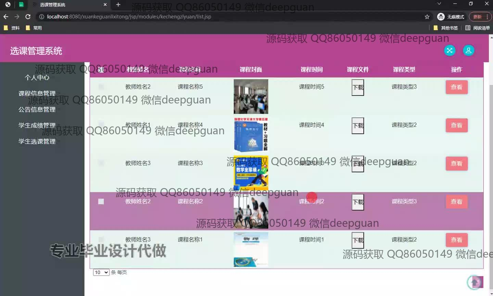
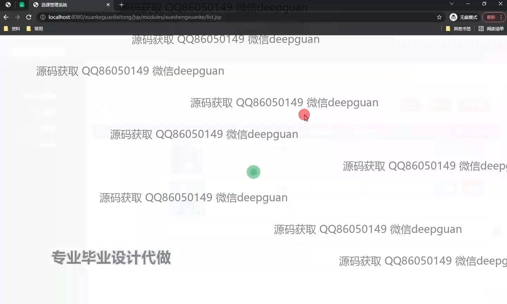
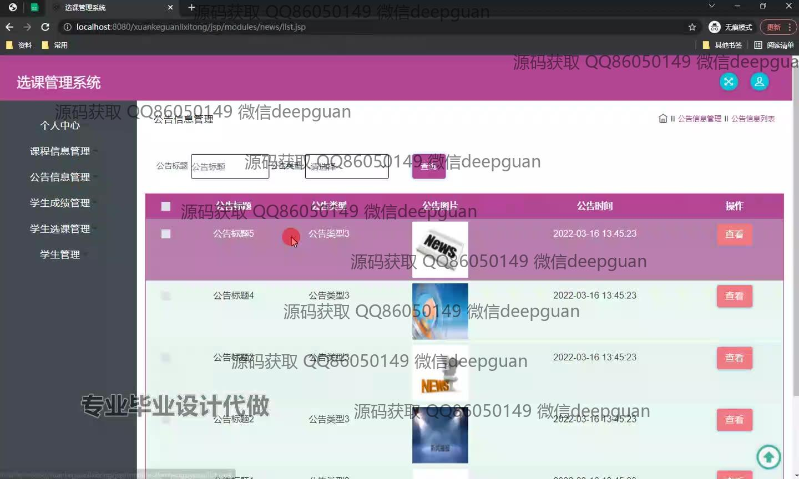
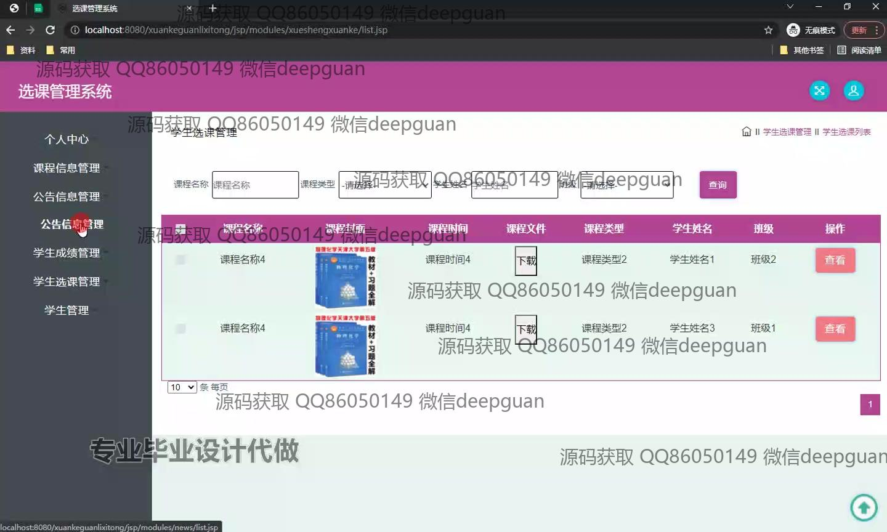
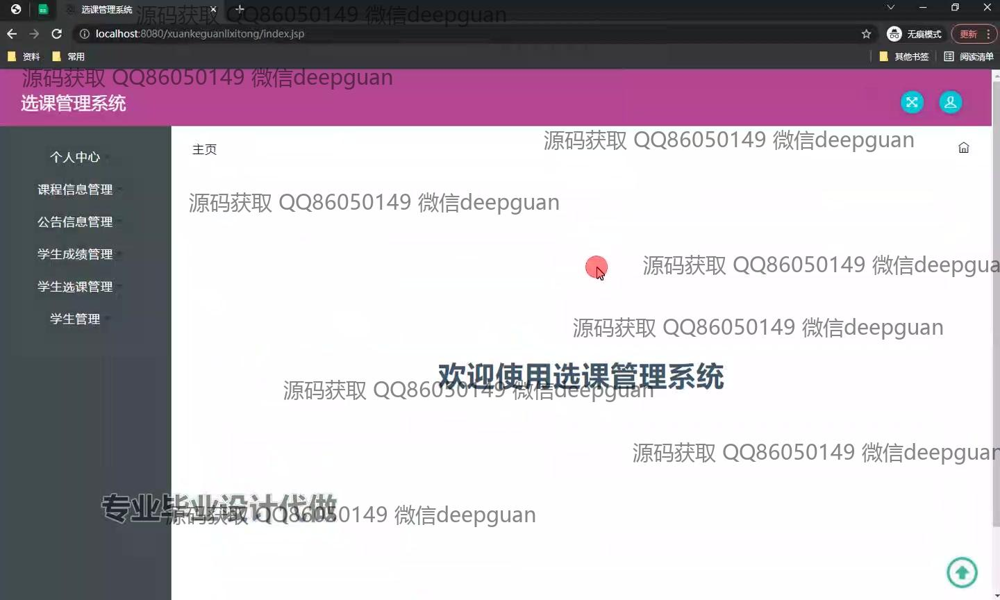
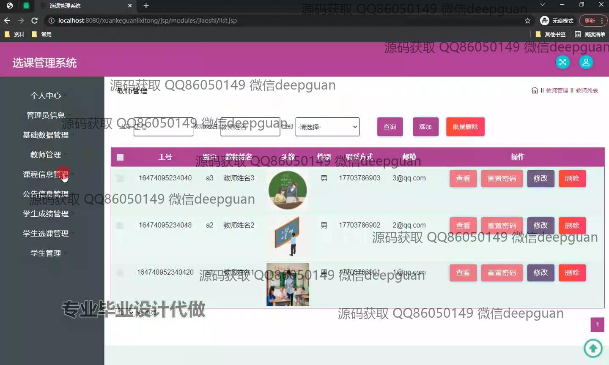
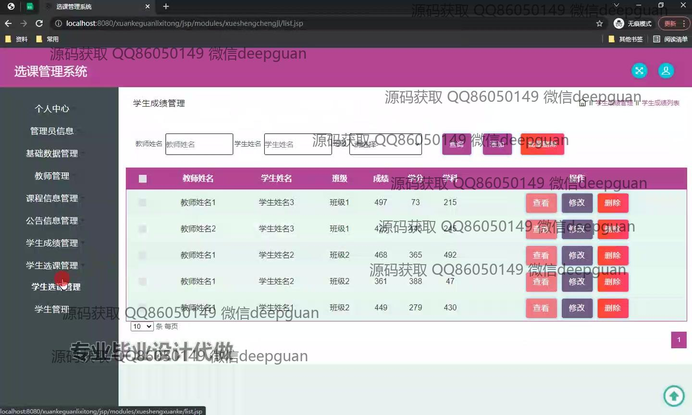

<h1 align="center">基于jsp技术的选课管理系统+jsp</h1>

## 简介
选课管理系统：角色分为管理员、教师和学生；功能涵盖课程管理、公告管理、成绩管理、选课管理和教师管理，界面简洁直观，便于用户操作与信息管理。    --计算机毕业设计源码；毕设源码；java毕业设计源码

## 联系方式

<h3 align="center">获取完整代码与数据库文件 + 微信：deepguan QQ: 86050149 QQ群: 783742310</h3>

<h3 align="center">可帮忙远程部署 包运行成功！提供远程部署、修改代码、设计文档指导、代码讲解等服务！</h3>

## 功能介绍（完整见运行截图）
管理员：管理员可以通过系统进行多项管理操作，包括课程信息管理、公告信息管理、学生成绩管理、学生选课管理和教师管理。管理员可添加、修改和删除课程信息，管理公告内容，以及查看和维护学生的成绩记录。系统还提供了对教师信息的全面管理功能，如教师名单的查看、信息修改以及账户的密码重置。

学生：学生用户可以浏览并选择课程，查看已选的课程信息，以及下载相关课程文件。系统支持学生按课程名称和课程时间筛选课程列表，并提供课程的详细信息查看功能。此外，学生可以通过系统查询自己的成绩，并从功能菜单访问个人中心以管理其个人信息。

教师：教师在系统中拥有查看和管理所教授课程的权限。教师可以浏览课程的详细信息，包括课程时间和类型，并能够下载或更新课程相关资源。系统还允许教师通过专门的管理界面查看学生的选课情况，并评估学生的成绩。

普通用户：普通用户关注于公告信息的查看和基础数据的检索。系统允许用户通过公告标题和类型进行查询和筛选，并查看公告的详细内容。整体设计的功能模块直观，用户可以通过主界面的导航栏快速访问所需模块，方便用户高效操作。

## 运行截图

本代码来源于网络,仅供学习参考使用!

